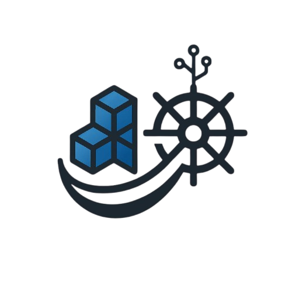

# wharf 

 


## Overview

Wharf is a full-stack web application designed to simplify Docker management on monolithic servers for teams and organizations. The platform provides a centralized interface for managing Docker resources through a web browser, eliminating the need for direct command-line Docker operations.

### Core Capabilities:

* `Container Management`: Start, stop, pause, create,update, delete, and monitor Docker containers
* `Image Management`: List, tag, delete, and prune Docker images
* `Volume Management`: Create, delete, list, and prune Docker volumes
* `Network Management`: Create, delete, and manage Docker networks and container connections
* `User Management`: Role-based access control (RBAC) with Read, Write, and Execute permissions
* `Monitoring`: Real-time container statistics and log viewing
* `Web Interface`: Complete React-based single-page application

### Security and Authentication

Wharf implements JWT-based authentication with role-based access control. Users have three permission levels:

* `Read`: View containers, images, volumes, networks
* `Write`: Start, stop, pause, create resources
* `Execute`: Delete, prune, remove resources

## Project Status

Currently the version 1.0.1 is released.

## Support

We’re building and maintaining this project to serve the community as a free and open source solution. However, there are ongoing costs involved, such as:

   * 🌐 Domain registrations

   * 🧪 Testing servers and infrastructure

   * 🛠️ Paid services/tools required during development

If you find this project useful, please consider supporting its development by sponsoring us. Your support will help us cover these expenses and continue to improve and maintain the project.

[💸 Sponsor this project](https://github.com/sponsors/fordevio)

Also If you find this project helpful or interesting, give it a ⭐️ on [GitHub](https://github.com/fordevio/wharf)! Your support helps the project grow and motivates community to keep improving it.
Also join the [#wharf](https://join.slack.com/t/fordev-io/shared_invite/zt-37ixcb48j-o9AnvibyCSc0PCRQdIZIHg) slack channel.

## Quickstart (on your Linux servers)

Prerequisite: 

* Install and run [docker](https://docs.docker.com/engine/install/)

* Run the wharf container 

```
sudo docker run -v /var/lib/wharf:/var/lib/wharf -v /var/run/docker.sock:/var/run/docker.sock -dp 9001:9001 --name wharf fordevio/wharf:latest 
```

The application can be acessed by the url `http://localhost:9001` on browser

For running the application locally visit [DEVELOPMENT](./docs/DEVELOPMENT.md)

## AI Generated Docs

https://deepwiki.com/fordevio/wharf


## Testing 

See [TESTING](./docs/TESTING.md)

## Contribution

See [CONTRIBUTION](./docs/CONTRIBUTION.md)

## Acknowledgements

The Wharf UI and logo is designed by [Pranjal Gopale](https://www.linkedin.com/in/pranjal-goupale-564a9230b/). We sincerely thank her for the creative contribution.